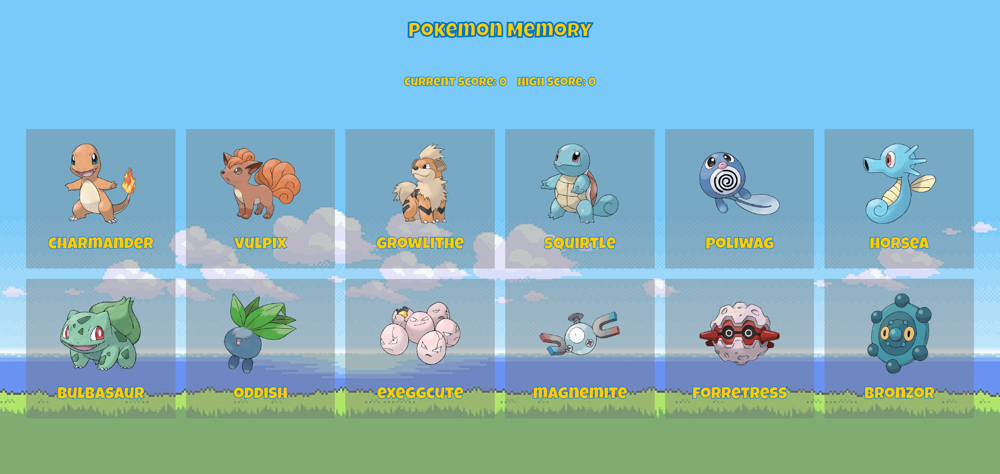

# Memory Game

A simple React game where the user tries to avoid clicking a card twice to get the highest score possible.

## Technologies Used

- **HTML**
- **CSS**
- **React**

## Project Screenshot

## Demo

You can view the live demo of the project here:  
[Live Demo](laith-memory-card-game.vercel.app)
